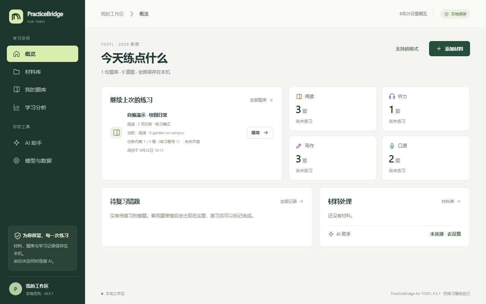
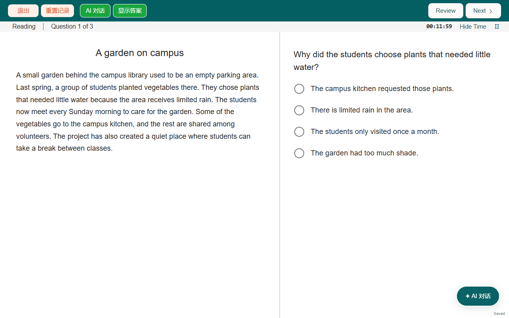

# PracticeBridge for TOEFL · 练习工作台

**把手上的托福练习材料，变成可以在机考界面里作答的题库。**

PracticeBridge for TOEFL 是一款 **0.5.1 本地练习软件**，面向 2026 年 1 月起的新版托福。你导入 PDF、Word、网页文字或练习包，它先保存原件，再识别出题目、选项、答案和音频的对应关系；确认后就可以按科目计时练习，每次作答和重练都留在本机。



## 能做什么

- **导入常见的新版托福材料。** ETS 官方练习卷（学生版和教师版）、整套模拟题、单一题型的练习集（例如 Complete the Words、Build a Sentence、Listen and Repeat、写邮件、学术讨论），以及从网页复制的文字。识别不出来的部分会保留在材料库，并说明缺了什么。
- **在仿机考界面里作答。** 阅读、听力、写作、口语四科，共 12 类题型：段落内补字、阅读分栏、词块组句、邮件与讨论编辑器、先听后录的口语等。每个阶段都有倒计时。
- **两种模式。** PRACTICE 按科目练习，可以回看、续做和重练；TEST 从头到尾连续考完四科，期间关闭学习辅助。
- **记录和复习。** 每次作答都保存题目快照，区分首次作答和重练；错题可以标记复习，学习分析页可按科目、题型、日期筛选。
- **AI 是可选的。** 基础的导入和练习不需要 AI。连接你自己的模型后，可以整理本机识别不了的材料、获取写作和口语的文字反馈、在答题时提问。每次联网前都会说明发送什么。



## 开始使用

**Windows 便携版：** 从本仓库的 Releases 下载 `PracticeBridge-for-TOEFL-0.5.1-win-x64.zip`，解压后运行文件夹里的 `PracticeBridge.exe`。请保留整个文件夹，不要只移动 EXE。便携版没有代码签名，第一次运行时 Windows 可能会提示"未知发布者"。

**从源码运行：** 需要 Node.js 22.16 或以上。

```powershell
npm ci --cache .cache/npm
$env:electron_config_cache = Join-Path (Get-Location) '.cache/electron'
node node_modules/electron/install.js
npm start
```

也可以运行 `npm run web`，用浏览器打开终端里显示的本机地址。服务只监听 `127.0.0.1`。项目根目录的 `打开练习工作台.cmd` 会优先启动已打包的便携版，找不到时再用开发版。

第一次打开是空工作区。想先试一试，可以在概览页点 **支持的格式**，下载本项目自编的练习包（9 道题、3 段合成音频，不是官方题目），再从 **添加材料** 导入。

## 导入材料

1. **保存原件。** 任何文件都可以先放进材料库，PDF 和配套音频可以放在同一批，也可以直接粘贴文字。
2. **整理成题目。** 本机会先尝试识别：带文字层的 PDF、DOCX、TXT、Markdown、练习包 JSON 和它们的 ZIP。识别依据题号、选项、答案表、题型标题和页面版式，不需要你手写任何格式。
3. **检查后加入题库。** 草稿默认隐藏题干和答案，打开作者视图可以逐项核对、修改，再选择已经完整的部分加入练习。缺题干、缺音频或对应关系不确定的题目会留下来等你补充。

本机识别不了的材料，可以交给你连接的模型分块整理。开始前会显示分成几块、最多发几次请求、最多用多少 token；每完成一块就保存一块。某一块出问题（例如回复被截断、模型拒答）时，只标记这一块并继续处理其他块，之后可以只重发未完成的部分。连续 3 块失败、API Key 被拒、额度不足或请求结果不确定时，作业会停下并说明原因，不会自动重发。

**扫描件和图片**可以用可选的英语 OCR：在 **模型与数据** 中确认安装后会下载公开的语言数据，启用后在材料页选择页码和区域识别。识别结果不会自动填进题目，需要对照原图手动确认。

**音频转写**需要你自备 faster-whisper 的 Python 环境和模型，在设置里配置并通过自检后使用。转写结果只用来帮助核对，不作为评分依据。

更详细的格式说明见 [输入格式](docs/输入格式.md) 和 [统一机考模板](docs/机考模板.md)。

## 练习与计时

在 **我的题库** 中选择套题，按科目进入 PRACTICE，或切到 TEST 开始整套测试。默认时限：阅读每个模块 12 分钟，Build a Sentence 整个任务 6 分 50 秒，写邮件 7 分钟，学术讨论 10 分钟，口语面谈每题最多 45 秒；跟读按题序 8、10、12 秒。材料里写明的时限优先采用，也可以在 **计时设置** 中自定义。

PRACTICE 到时后停在 00:00，可以继续作答；TEST 到时即截止。本软件没有实现官方的自适应分流，也不换算官方分数。

## 连接模型（可选）

在 **模型与数据** 中选择 OpenAI 官方 API，或任何兼容 Chat Completions 的服务（包括本机运行的模型服务），填入服务地址、模型名和 API Key。所用服务需要支持结构化 JSON 输出。

- API Key 默认只在本次运行中使用；Windows 桌面版也可以选择用系统加密保存。密钥与确认过的服务地址绑定，不会写进备份。
- 所有请求都由你点击触发。答题时的 AI 对话只发送当前页面的题面和草稿；隐藏的答案和听力原文要你主动显示后才会附带；音频和图片不发送。
- 口语反馈基于你回听后确认的转写文字，不评价发音、口音和语调。
- Codex CLI 目前只做能力检测，不能用来处理材料或批改。

## 数据保存在哪里

- 便携版的数据保存在 EXE 旁边的 `data/` 文件夹；开发模式保存在项目根目录的 `data/`。也可以用环境变量 `PRACTICEBRIDGE_DATA_DIR` 指定位置。
- 材料原件、题库媒体、录音、识别结果和作业进度都在这个文件夹里。换电脑或升级时，请用 **模型与数据 → 导出个人完整备份**，不要只复制其中某个文件。恢复备份前会先保存当前状态的快照。
- 题库可以单独导出为 ZIP 分享；个人备份包含你的材料和作答记录，请不要公开。

## 开发

```powershell
npm test
npm run check
npm run verify
npm run package
```

`npm run verify` 默认运行全部浏览器界面测试，需要本机安装 Microsoft Edge。浏览器测试使用模拟麦克风和本地协议样本，不调用付费模型。发布流程见 [发布说明](docs/RELEASING.md)，贡献方式见 [CONTRIBUTING](CONTRIBUTING.md)，安全问题请按 [SECURITY](SECURITY.md) 报告。最近一次自动检查的范围和跳过项记录在 [检查摘要](docs/verification-summary.json)。

## 已知限制

- 目前只支持 2026 年 1 月起的新版托福题型，不处理旧版 TPO 格式。
- 本机识别针对常见版式做了测试，但不保证能识别任意材料；结构检查通过不代表题目或答案本身正确，加入题库前请核对。
- OCR 和转写的准确率取决于原件质量和你的环境，项目的测试只用了自编的图片和音频。
- 没有官方分数换算、安装向导和自动更新；便携版没有代码签名，也还没有在更多电脑上测试过。

## 许可与商标

TOEFL® 是 ETS 的注册商标。PracticeBridge for TOEFL 是独立项目，与 ETS 没有关联，也未获 ETS 认可或授权；名称中的 TOEFL 仅用于说明本软件面向的考试。

代码采用 [MIT 许可](LICENSE)。项目自编的演示材料标注为 CC0-1.0，不会自动导入。第三方依赖及其许可见 [第三方说明](THIRD_PARTY_NOTICES.md)。请不要把个人 `data/`、备份、录音、密钥或没有再分发权的材料提交到公开仓库。
