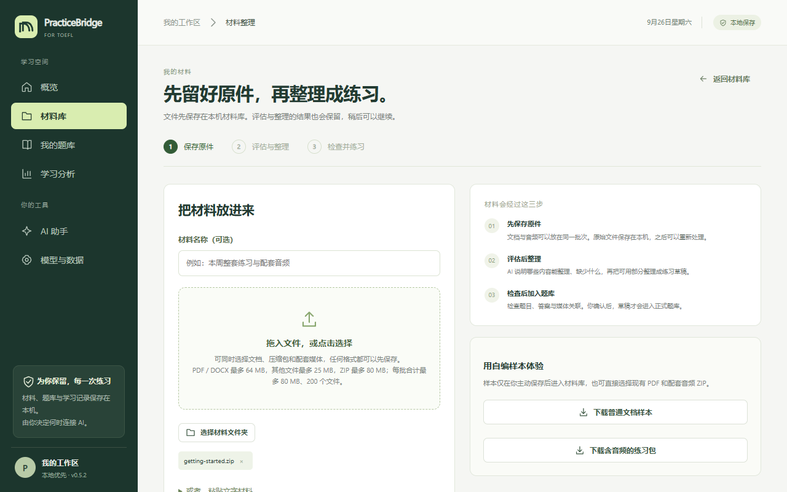
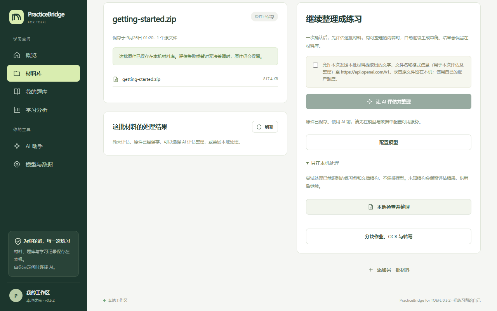
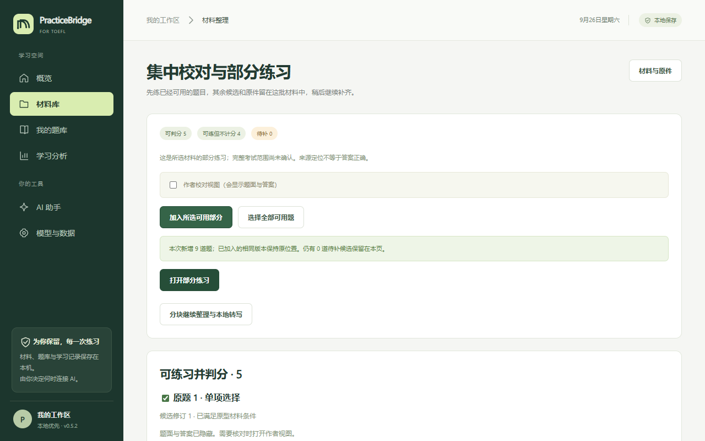
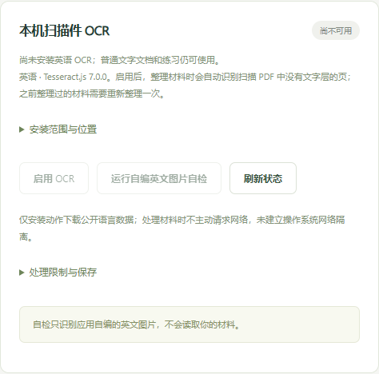

# PracticeBridge for TOEFL · 练习工作台

中文 · [English](README.en.md)

**把手上的托福练习材料，变成可以在机考界面里作答的题库。**

PracticeBridge for TOEFL 是一款面向 2026 年 1 月起新版托福的本地练习软件。你把 PDF、Word、网页文字或练习包放进来，它会先保存原件，再识别出题目、选项、答案和音频的对应关系。你确认之后，就可以按科目计时练习；每次作答和重练都保存在你自己的电脑上。

软件免费，不需要注册账号。基础的导入和练习完全在本机完成，不联网。

**一句话了解**：免费 · 开源（MIT） · Windows 10/11 便携版 · 无需注册 · 导入和练习离线完成 · 只支持 2026 年 1 月起的新版托福题型 · 不自带官方题目，需要导入自己的练习材料 · 与 ETS 没有关联。项目介绍页：<https://2rr6.github.io/PracticeBridge-for-TOEFL/>


## 目录

- [它能做什么](#它能做什么)
- [下载和打开（Windows）](#下载和打开windows)
- [第一次使用：用示例练习包走一遍](#第一次使用用示例练习包走一遍)
- [导入自己的材料](#导入自己的材料)
- [扫描版 PDF：安装英语 OCR](#扫描版-pdf安装英语-ocr)
- [开始练习](#开始练习)
- [连接 AI（可选）](#连接-ai可选)
- [备份、换电脑和升级](#备份换电脑和升级)
- [常见问题](#常见问题)
- [已知限制](#已知限制)
- [开发者说明](#开发者说明)
- [许可与商标](#许可与商标)

## 它能做什么

- **导入常见的新版托福材料**：ETS 官方练习卷（学生版和教师版）、整套模拟题、单一题型的练习集（例如 Complete the Words、Build a Sentence、Listen and Repeat、写邮件、学术讨论）、从网页复制的文字，以及扫描版 PDF。
- **在仿机考界面里作答**：阅读、听力、写作、口语四科，共 12 类题型。每个阶段都有倒计时。
- **两种模式**：PRACTICE 按科目练习，可以回看、续做和重练；TEST 从头到尾连续考完四科，期间不提供学习辅助。
- **记录和复习**：每次作答都会保存，答错的题可以标记复习，学习分析页可以按科目、题型、日期筛选。
- **AI 是可选的**：连接你自己的模型后，可以整理软件本身读不懂的材料、获取写作和口语的文字反馈、在答题时提问。

## 下载和打开（Windows）

需要 Windows 10 或 Windows 11（64 位）。

1. 打开本仓库的 [Releases 页面](https://github.com/2rr6/PracticeBridge-for-TOEFL/releases)，在最新版本下面点击名为 **`PracticeBridge-for-TOEFL-版本号-win-x64.zip`** 的文件下载（约 200 MB）。
2. 在下载好的 ZIP 文件上**点右键 → 全部解压缩**，选一个你找得到的位置，例如 `D:\PracticeBridge`。
   不要直接在压缩包里双击运行，那样软件无法保存你的记录。
3. 打开解压出来的文件夹，双击 **`PracticeBridge.exe`**。
4. 第一次打开时，Windows 可能会弹出蓝色窗口"Windows 已保护你的电脑"。这是因为软件没有购买代码签名证书，不代表有问题。点击 **更多信息 → 仍要运行** 即可。以后再打开就不会出现了。
5. 想更方便地打开，可以在 `PracticeBridge.exe` 上点右键 → **发送到 → 桌面快捷方式**。

> 请保留整个文件夹，不要把 `PracticeBridge.exe` 单独移出来。你的所有记录都保存在它旁边的 `data` 文件夹里。

## 第一次使用：用示例练习包走一遍

第一次打开时题库是空的。建议先用软件自带的示例（9 道自编题，含 3 段合成音频，不是官方题目）熟悉一下流程：

1. 在概览页右上角点 **支持的格式**，在弹出的窗口里点 **自编练习包（含合成音频）**，保存这个 ZIP 文件。
2. 点 **添加材料**，把刚下载的 ZIP 拖进虚线框（或点虚线框选择文件），再点 **保存原件到材料库**。

   

3. 保存后会进入这批材料的页面。点开 **只在本机处理**，再点 **本地检查并整理**。

   

4. 软件会进入"集中校对"页面，把题目分成"可判分""可练但不计分""待补"三类。点 **选择全部可用题 → 加入所选可用部分**，看到"本次新增 9 道题"就说明成功了。点 **打开部分练习** 就能开始做题。

   

## 导入自己的材料

操作和上面一样：**添加材料 → 保存原件到材料库 → 只在本机处理 → 本地检查并整理 → 选择题目加入练习**。

**可以放进来的文件**

| 类型 | 说明 |
| --- | --- |
| PDF | 带文字的 PDF 最好。扫描版 PDF 需要先安装英语 OCR，见下一节 |
| Word（.docx） | 直接读取文字和表格 |
| 文字 | .txt、.md，或者在"添加材料"页面点"或者，粘贴文字材料"直接粘贴网页内容 |
| 音频 | .mp3、.wav 等，和题目放在同一批。软件会尽量按文件名和题号对应起来 |
| 压缩包 | 以上文件打成的 ZIP；也可以点"选择材料文件夹"一次选整个文件夹 |

单个 PDF/Word 最大 64 MB，其他文件最大 25 MB，一批合计最大 80 MB。

**整理结果怎么看**

- **可判分**：题目完整、有标准答案，做完会自动判对错。
- **可练但不计分**：例如写作、口语题，或者材料里没有答案的题。可以练，但不计入正确率。
- **待补**：缺了题干、选项或音频。它们会留在这批材料里，等你补齐或换一份更完整的材料。

**请核对一下**：软件是按版式"读"出题目的，不能保证百分之百正确。勾选页面上的 **作者校对视图（会显示题面与答案）**，就能看到每道题的题干和答案，发现错误可以直接修改。

**读不出来怎么办**

- 页面提示"没有文字层"，说明是扫描件：安装英语 OCR 后重新整理即可，见下一节。
- 版式特别的材料，本机可能读不全。这时可以连接 AI，让 AI 分块整理（见"连接 AI"）。
- 原件永远会保留在材料库里，整理失败也不会丢。

## 扫描版 PDF：安装英语 OCR

OCR 就是"从图片里认字"。安装后，软件整理材料时会**自动识别扫描页**，你不需要一页一页地操作。



1. 点左侧 **模型与数据**，找到 **本机扫描件 OCR** 卡片。
2. 点开 **安装范围与位置**，勾选 **我确认上述下载上限和安装位置**，再点 **下载并安装英语数据**。需要联网，下载一次即可。
3. 安装完成后点 **启用 OCR**。可以点 **运行自编英文图片自检** 确认能正常工作。
4. 回到材料页，重新点 **本地检查并整理**。材料卡片上会显示"正在识别扫描页 8/35"这样的进度，每页大约几秒钟，可以先去做别的事。

识别完成后，来自扫描页的题目都会标注"扫描识别"。

**扫描页的答案宁可留空，也不给错的。** 本机 OCR 容易把 C 认成 0、把 l 认成 I、数错补字题的空格。所以对扫描页，软件只采用通过题型校验的答案（例如连词成句必须恰好用上词块，补字题的字母数要和空格对得上），拿不准的一律留空，并在处理结果里说明原因。

### 让 AI 看图校对扫描页（推荐）

如果你在 **模型与数据** 里连接了能看图的 AI 服务（支持图片输入的模型），整理完扫描材料后，材料页和校对页会出现 **用 AI 看图校对扫描页**。勾选确认发送范围后点它，软件会把每一页的图片和本机识别的文字一起发给 AI，让它对照图片逐行改正错字，然后自动重新整理。每页只校对一次，结果保存在本机，之后重新整理不会再花钱。

我们把 15 份带标准答案的练习材料（约 400 页，含 ETS 官方练习卷和练习册）做成模拟扫描件测试过：

| | 只用本机 OCR | 本机 OCR + AI 看图校对 |
|---|---|---|
| 给出的答案里有几个错 | 0 个（共给出 1142 个，覆盖普通、模糊倾斜、手机拍照三种质量） | 0 个（共给出 282 个） |
| 能确定答案的题目比例 | 普通扫描约 60%，模糊倾斜约 50%，手机拍照约 30%，其余留空 | 约 88% |
| 费用 | 免费 | 按你的 AI 服务计费；测试用的 DeepSeek-V4.1-Flash 一套 35 页的练习卷约 0.3 元、1 分钟 |

AI 那一列只测了 5 份材料，模拟扫描件的字体也比较规整；真实的手机照片、手写批注、多次复印的材料效果可能更差。没有标注"扫描识别"的题目来自 PDF 本身的文字，不受 OCR 影响。

想自己核对时，在校对页勾选 **作者校对视图**：扫描页的题目会直接显示原件截图，一张是题目开头，一张是答案所在的那一行，对照一下就行，不用去翻 PDF。

## 开始练习

1. 点左侧 **我的题库**，会看到仿官方考试的列表。
2. **PRACTICE**：点某一科下面的 **未开始**，就开始练这一科；中途退出后，下次点 **继续练习** 可以接着做。
3. **TEST**：切换到顶部的 TEST，点 **开始整套测试**，会连续考完四科，期间不提供学习辅助。
4. 做完后可以在 **学习分析** 里回看每次作答，答错的题可以标记复习或重练。

**默认时限**：阅读每个模块 12 分钟；Build a Sentence 整个任务 6 分 50 秒；写邮件 7 分钟；学术讨论 10 分钟；口语面谈每题最多 45 秒；跟读按题序 8、10、12 秒。材料里写明的时限优先。如果想放宽时间，可以在题库页点 **计时设置** 自定义。

PRACTICE 模式到时间后停在 00:00，还可以继续作答；TEST 模式到时间就结束。


**口语题**需要麦克风。如果录不到声音，请检查 Windows 的 **设置 → 隐私和安全性 → 麦克风**，确认允许桌面应用使用麦克风。

## 连接 AI（可选）

不连接 AI 也能正常导入和练习。连接后，可以：

- 让 AI 整理本机读不懂的材料；
- 让 AI 看图校对扫描页，补全本机拿不准的答案（需要支持图片输入的模型，见上面"让 AI 看图校对扫描页"）；
- 获取写作、口语的文字反馈；
- 做题时点 **AI 对话** 提问。

**你需要准备**：一个支持的模型服务和它的 API Key。例如 OpenAI 官方 API，或其他兼容 OpenAI 接口的服务，包括在自己电脑上运行的模型。使用 AI 产生的费用由你的服务商账户支付，本软件不收费。

**设置步骤**

1. 点左侧 **模型与数据**，在 **接入方式** 里选择服务类型。
2. 填写 **服务地址**、**模型名称** 和 **API Key**，点 **保存配置**。
3. 勾选同意发送一次测试文字，点 **测试已保存的连接**。显示成功就可以用了。

**关于隐私和费用**

- 每次联网之前，界面都会说明要发送什么；不勾选同意就不会发送。
- AI 整理材料前会显示最多发多少次请求、用多少 token，你确认后才开始。
- API Key 默认只在本次打开软件期间使用；也可以选择用 Windows 系统加密保存。密钥不会写进备份文件。
- 录音文件不会发给 AI；口语反馈基于你确认过的转写文字，不评价发音。

## 备份、换电脑和升级

**所有数据都在软件文件夹里的 `data` 文件夹中**：包括材料原件、题库、作答记录和录音。

- **备份**：点 **模型与数据 → 导出个人完整备份**，会得到一个 ZIP 文件，建议定期保存到 U 盘或网盘。
- **换电脑**：在新电脑上下载软件，点 **模型与数据 → 从个人备份恢复**，选择备份文件，勾选确认后恢复。
- **升级到新版本**：
  1. 先在旧版里导出一次个人完整备份，以防万一；
  2. 下载并解压新版到一个新文件夹；
  3. 关闭旧版，把旧版文件夹里的整个 `data` 文件夹复制到新版的 `PracticeBridge.exe` 旁边；
  4. 打开新版，记录都还在。也可以直接用"从个人备份恢复"。
- **分享题库**：在题库页可以单独导出题库包给同学。个人备份里有你的材料和作答记录，请不要公开分享。

## 常见问题

**怎么把托福练习 PDF 变成机考形式的练习？**
下载本软件，点 **添加材料** 放入 PDF，保存后选择 **只在本机处理 → 本地检查并整理**。软件会识别题目、选项和答案，你确认后加入题库，就能在仿机考界面按科目计时练习。详细步骤见上面的"第一次使用"。

**有没有免费的 2026 新版托福练习软件？**
本软件免费开源，专门面向 2026 年 1 月起的新版托福（阅读、听力、写作、口语四科的新题型），不需要注册，离线使用。

**软件自带托福题目吗？**
不自带官方题目。它是把你手上已有的练习材料（例如 ETS 官方练习卷、模拟题、练习册）整理成可以作答的题库；软件只附带一套 9 道的自编示例题用于试用。

**双击后没有反应，或者被杀毒软件拦截？**
请确认是先解压、再运行解压出来的文件夹里的 `PracticeBridge.exe`。如果杀毒软件拦截，可以把这个文件夹加入信任。本软件完全开源，源代码就在这个仓库里。

**导入后一道题都没有？**
打开这批材料，看"处理结果"里的提示：
- 如果说"没有文字层"，是扫描件，请先安装英语 OCR；
- 如果是其他原因，可以试试连接 AI 整理，或者换一份文字版的材料。

**扫描版的练习册能用吗？答案准吗？**
能用。安装英语 OCR 后，扫描页会自动识别；本机拿不准的答案会留空而不是猜。连接能看图的 AI 再点 **用 AI 看图校对扫描页**，大部分留空的答案可以补全。详见上面的"让 AI 看图校对扫描页"。

**识别出来的答案不对？**
在校对页勾选 **作者校对视图**，可以直接修改题干、选项和答案，再重新加入练习。

**做题时关掉了软件，进度会丢吗？**
不会。作答会自动保存草稿，下次从概览页的"继续上次的练习"或题库里的"继续练习"接着做。

**要付费吗？需要一直联网吗？**
软件免费，不需要账号。导入和练习完全离线。只有在你主动使用 AI、下载 OCR 数据时才会联网。

**能用在 Mac 上吗？**
目前只提供 Windows 版。Mac 用户可以从源码运行浏览器版本（见"开发者说明"），但没有经过完整测试。

## 已知限制

- 只支持 2026 年 1 月起的新版托福题型，不处理旧版 TPO。
- 本机识别针对常见版式做过测试，但不保证能读懂所有材料；加入题库前请核对题目和答案。
- 扫描件依赖 OCR：本机识别拿不准的答案会留空，连接看图 AI 校对后才能补全大部分；手写内容无法识别。
- 没有官方分数换算、安装程序和自动更新；软件没有代码签名；目前只测试过少量电脑。

## 开发者说明

从源码运行需要 Node.js 22.16 或以上：

```powershell
npm ci --cache .cache/npm
$env:electron_config_cache = Join-Path (Get-Location) '.cache/electron'
node node_modules/electron/install.js
npm start
```

也可以运行 `npm run web`，用浏览器打开终端里显示的本机地址。服务只监听 `127.0.0.1`。项目根目录的 `打开练习工作台.cmd` 会优先启动已打包的便携版。

```powershell
npm test
npm run check
npm run verify
npm run package
```

`npm run verify` 默认运行全部浏览器界面测试，需要安装 Microsoft Edge；测试使用模拟麦克风和本地协议样本，不调用付费模型。格式说明见 [输入格式](docs/输入格式.md) 和 [统一机考模板](docs/机考模板.md)，发布流程见 [发布说明](docs/RELEASING.md)，贡献方式见 [CONTRIBUTING](CONTRIBUTING.md)，安全问题请按 [SECURITY](SECURITY.md) 报告，最近一次自动检查记录在 [检查摘要](docs/verification-summary.json)。

## 许可与商标

TOEFL® 是 ETS 的注册商标。PracticeBridge for TOEFL 是独立项目，与 ETS 没有关联，也未获 ETS 认可或授权；名称中的 TOEFL 仅用于说明本软件面向的考试。

代码采用 [MIT 许可](LICENSE)。项目自编的演示材料标注为 CC0-1.0，不会自动导入。第三方依赖及其许可见 [第三方说明](THIRD_PARTY_NOTICES.md)。请不要把个人 `data` 文件夹、备份、录音、密钥或没有再分发权的材料提交到公开仓库。
