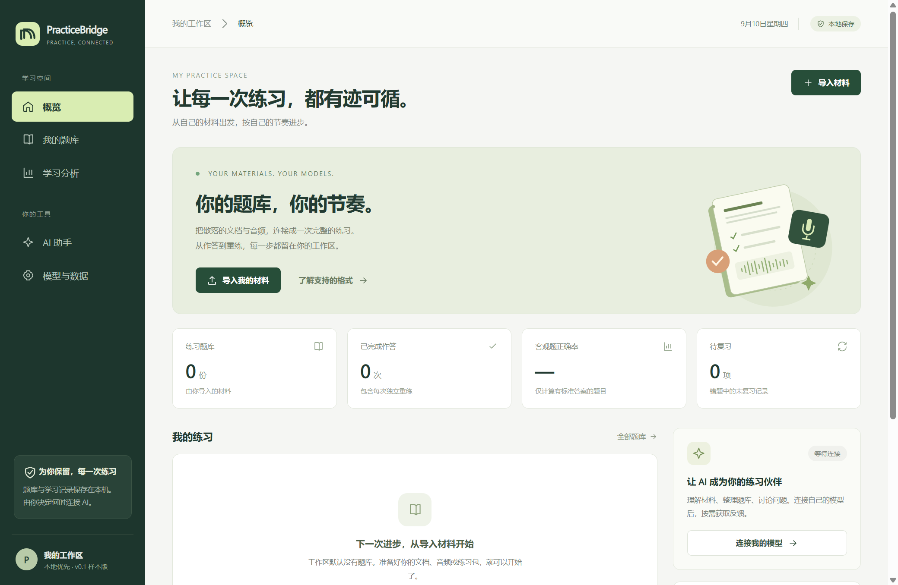

> 历史资料：正文反映该文档原编写时点的版本、方案和验证状态，不能作为当前版本全部验收通过的证明。当前功能与限制见 [README](../README.md)。

# PracticeBridge 0.1.0 · 首版验证结果

日期：2026-09-10。范围：本目录新建的独立应用与 Windows x64 便携版。

**2026-09-10 启动入口修复：** 用户报告双击根目录 CMD 无法打开。复现时，旧脚本的 UTF-8 内容与 LF 换行导致 Windows 命令解释出现截断。已将入口改为 ASCII / CRLF，并使用独立跳转分支启动程序、清除继承的测试隐藏标记。通过该 CMD 在正常 Windows 环境重新启动，脚本退出码为 0，实际出现标题为“PracticeBridge · 练习工作台”的响应正常窗口。此前 EXE 直接启动测试没有覆盖双击入口；现在已补验证。应用程序与用户数据未因本次修复而重建。

**结论：首版可运行样本已完成。** 默认空题库；从普通文档或规范包到作答、保存、回顾、重练和导出的流程已跑通。下列结果均来自本轮实际执行，不代表真人口语质量或官方评分验证。

## 最终检查

| 检查组 | 最终结果 | 验证内容 |
| --- | --- | --- |
| 单元、接口与数据边界 | **59 / 59 通过** | 导入忠实性、来源和答案关联、ZIP/媒体限制、原子保存、Windows 占用重试、不可变作答、串行反馈、备份与恢复、模型失败和额度边界 |
| 完整浏览器工作流 | **16 项通过** | 空状态、9 道自编样本、续做、Original/Retry、录音保存、反馈、筛选、重启回放、导出恢复与窄屏布局 |
| 普通文档纵向流程 | **4 项通过** | 无专用标记的 Word + 音频文件夹；一次表单修正；局部答案表；导出后重新导入并播放 |
| 练习页面异步状态 | **3 项通过** | 提交延迟、旧回顾延迟、初始保存延迟均不覆盖新页面，也不产生意外提交 |
| 其他题型与失败路径 | **10 项通过** | 组句、邮件清空与续做、讨论、听力、跟读、麦克风拒绝、录音上传失败重试、模拟模式、默认无外联 |
| 助手与导入页面异步状态 | **3 项通过** | 迟到的聊天、配置保存和导入草稿响应不覆盖新页面或新输入 |
| 实际 Windows 便携版 | **5 项通过** | 独立 EXE 启动、隔离渲染、关闭前保存、重启续做、录音时拒绝错误关闭、打包环境内 PDF 导入 |
| 打包内容核对 | **27 个运行文件逐一匹配** | 源码、界面、媒体示例与图标和包内字节一致；测试记录、缓存、凭据及开发工具不在运行包中 |

源码检查和浏览器测试使用 Node.js 22.22.3、Microsoft Edge 与 Playwright；便携版实际使用 Electron 44.3.0。所有最终检查均为通过状态。开发中出现过的写入占用、页面竞态和测试时序问题已修复或校正测试等待方式后重新验证，没有用早期失败或修改前的结果代替最终结果。

## 普通文档实际做了什么

使用自编的普通 Word 文档，没有 `@question` 等项目专用标记。文档中有 4 个题组、5 道题，多组都从题号 1 开始。两段音频都叫 `prompt.wav`，分别位于 `set-a/` 和 `set-b/`。

初始文档故意把面谈题组的音频写成不存在的 `missing.wav`，导入被阻止。通过作者校对表单，仅把 **Interview / 题组共用音频** 改为 `set-b/prompt.wav`，重新校验后导入。没有编辑数据库、手写 JSON 或逐题重建。

第一组答案 B、第二组答案 A、题干里的 NOT、题目顺序和来源位置均保留。没有答案表条目的题目，实际作答后仍为 `unscored`，没有被记错。随后导出到一个干净工作区重新导入，比较题目字段和音频哈希，并实际播放两个对应音频，都通过。

校对界面保留首次提取的来源提示供对照；当前提交还会重新执行结构和媒体校验。

## 口语闭环的证据边界

实际通过的链路为：**合成题目录音播放 → 浏览器模拟麦克风输入 → MediaRecorder → 本地文件 → 作答记录 → 重启后回放 → 已确认转写的本地模型协议测试 → 独立 Retry**。

两次尝试具有独立录音标识、转写和题目快照。第一份反馈只归属第一份 Attempt，不覆盖 Retry。录音上传失败时保留当前页面内的音频、阻止误提交和离开；重试后成功保存。关闭桌面窗口时不会先关闭服务而使录音无法保存。

**没有使用真人麦克风内容，也没有让模型实际听录音。** 测试中的确认转写是明确的合成测试输入。它验证数据链路和交互，不能证明真人口语转写准确率、发音判断或学习反馈质量。

## 模型验证的证据边界

OpenAI Responses 请求形状、结构化输出、超时、失败、密钥不落盘等已用受控响应测试。兼容接口还通过了真正的本机 HTTP 往返和界面反馈流程；返回的是本地协议测试样本。

未提供或读取真实 API Key，没有进行付费模型调用，没有复用其他应用的登录凭据。真实模型名称、额度、服务兼容性及建议质量仍需在用户自行配置后验证。Codex CLI 仅检测，服务层推理入口保持关闭。

## 打包与数据

已生成 `dist/PracticeBridge-win32-x64/PracticeBridge.exe`，根目录启动入口可以打开该程序。便携版的正常数据目录在交付时没有练习状态；测试使用独立目录，用户第一次打开仍是空题库。

打包程序 `resources/app.asar` 的 SHA-256：

```text
4a1c04b461f9838bd9e631827af90c45e0e7da2ebbf81fb51373ba8dbcf5efe0
```

源码包由明确的目录白名单生成，不包含 `data/`、`test-results/`、缓存、运行日志或密钥。第三方依赖的一条中等风险 ZIP 解压通告仍有记录，当前应用未使用受影响的文件系统解压路径；见 [第三方说明](../THIRD_PARTY_NOTICES.md)。未将其描述为依赖本身已修复。

## 本机证据位置

以下详细产物位于本机 `test-results/`，不随源码分享包导出：

- `verification-1789027786339/result.json`：最终完整验证汇总，各阶段退出码均为 0。
- `ui-1789027793536/result.json`：16 项浏览器工作流与截图。
- `worksheet-1789027801327/result.json`：普通 Word 导入及唯一字段修改记录。
- `desktop-portable-1789027677927/result.json`：实际便携版验证。
- `packaged-inventory.json`：运行文件哈希比较和排除项检查。

随源码提供的概要：[verification-summary.json](verification-summary.json)。

## 尚未验证

另一台电脑的安装与使用；真实私人题库及保留样本的导入准确率；真人麦克风与口音；实际付费或本地推理模型的建议质量；官方评分一致性。扫描件 OCR、自动转写、完整官方题型和自适应考试不属于本样本的已实现范围。


